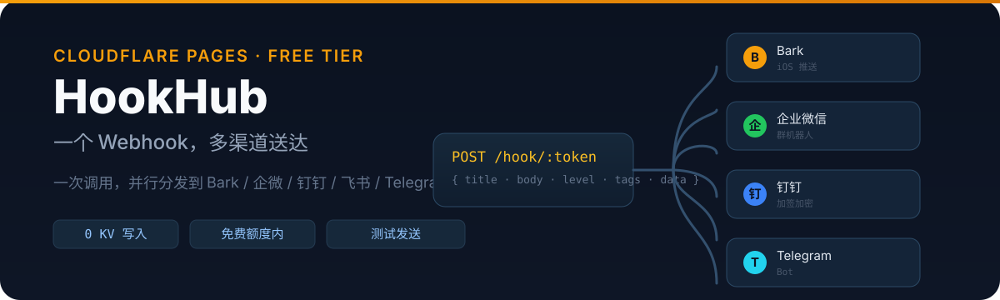

<p align="center">
  
</p>

# HookHub

**一个 Webhook，多渠道送达。** 部署在 **Cloudflare Pages** 的通用 Webhook 分发服务：调用方只需往一个统一格式的地址发 HTTP 请求，HookHub 按你配置的规则，把消息**并行分发**到 Bark、Server酱、PushPlus、企业微信、钉钉、飞书、Telegram、ntfy、Gotify、Discord、Slack、邮件（Resend）等渠道，也可以对接任意自定义 Webhook URL。

**设计目标：完全运行在 Cloudflare Free 计划免费额度内，不产生任何费用，零日志、零状态。**

---

## 目录

- [特性](#特性)
- [免费额度红线（务必先读）](#免费额度红线务必先读)
- [全局变量与绑定清单（部署前必看）](#全局变量与绑定清单部署前必看)
- [快速部署（GitHub 关联方式）](#快速部署github-关联方式)
- [首次使用](#首次使用)
- [调用方式](#调用方式)
- [渠道列表与各渠道配置教程](#渠道列表与各渠道配置教程)
- [模板与映射](#模板与映射)
- [路由与分发](#路由与分发)
- [KV 数据结构](#kv-数据结构)
- [API 一览](#api-一览)
- [安全设计](#安全设计)
- [本地开发 / 测试](#本地开发--测试)
- [使用注意事项（完整清单）](#使用注意事项完整清单)
- [常见问题（FAQ）](#常见问题faq)
- [License](#license)

---

## 特性

- **通用入口**：`POST /hook/:token` 支持 JSON / `text/plain` / `form-urlencoded`，也支持 `GET /hook/:token?title=&body=&level=`。
- **并行分发（fan-out）**：一个请求同时发往多个渠道，`Promise.allSettled` 聚合结果一并返回。
- **路由规则**：按 `channel` / `level` / `tags` / `data.xxx` 匹配，支持渠道组（`group:oncall`）、降级链（failover）、默认兜底渠道。
- **可视化后台**：渠道、令牌、路由、模板全部在网页上配置，含**测试发送**按钮与**实时消息预览**。
- **零 KV 写入的限流**：进程内存滑动窗口（每令牌 60 次/分），不写 KV、不落日志。
- **安全**：管理鉴权（常量时间比较）、可选 HMAC 签名校验、防 SSRF 内网段黑名单、请求体 64KB 上限、密钥脱敏展示。
- **可迁移**：后台一键导出/导入全部配置 JSON，备份或换域名秒级迁移。

---

## 免费额度红线（务必先读）

> **结论先行**：只要保证「收到 webhook 时不写 KV」，KV 写入量就只取决于你手动改配置的次数，永远碰不到 1000/天。

| 资源 | 免费额度 | 本项目用法 | 风险 |
|---|---|---|---|
| Pages Functions 请求 | 100,000 / 天 | 每次 webhook 调用消耗 1 次 | 低（纯转发消耗少） |
| **KV 写入** | **1,000 / 天** | **仅管理员保存配置时写** | **唯一真正的红线** |
| KV 读取 | 100,000 / 天 | 配置读取（加内存缓存后大幅降低） | 低 |
| KV 删除 / 列表 | 1,000 / 天 | 仅管理员删配置 | 低 |
| KV 存储 | 1 GB | 仅存配置 JSON，几十 KB | 无 |
| CPU 时间 | 10ms / 请求（免费） | 转发逻辑极轻 | 注意不要做重计算 |

**另一个必须知道的事实**：Cloudflare **Free 计划没有超额扣费机制**——超了就是请求被拒（429 / 报错），**不会产生账单**。只有账户升级为 Workers **Paid** 之后才会有超额计费。

> ⚠️ **正确做法是保持账户在 Free 计划，不要去精细限流，更不要误升级 Paid。**

本项目为此做了三件事：

1. **webhook 请求路径零 KV 写入**：限流用进程内存（滑动窗口）、不记录日志、不统计用量、不做去重。
2. **配置读取走内存缓存**（60s TTL），绝大多数请求根本不碰 KV。
3. **KV 写入点白名单硬拦截**：`functions/_lib/kv.js` 中只有 `token:` / `channel:` / `route:` / `group:` / `settings:global` 这些管理配置 key 允许写，任何其他代码路径调用 `put` / `delete` 都会直接抛错。

---

## 全局变量与绑定清单（部署前必看）

### KV 绑定（唯一必需绑定）

| 绑定名（Variable name） | 类型 | 必填 | 说明 |
|---|---|---|---|
| `KV_CONFIG` | KV Namespace | ✅ | 存全部配置。**拼写必须完全一致**（代码硬编码读取 `env.KV_CONFIG`），拼错会 500「缺少 KV_CONFIG 绑定」 |

### 环境变量（Secret）

在 Pages 控制台 **Settings → Environment variables** 里以**加密**方式添加（Production / Preview 都要加）：

| 变量名 | 必填 | 说明 | 代码读取点 |
|---|---|---|---|
| `ADMIN_PASSWORD` | ✅ | 管理员密码，所有 `/api/*` 管理接口校验用（`X-Admin-Password` 请求头或 `Authorization: Bearer`），常量时间比较 | `functions/api/_lib.js` |
| `SIGN_SECRET` | 可选 | 启用后，调用 `/hook/:token` 必须携带 `X-Signature` + `X-Timestamp` 头（HMAC-SHA256 校验） | `functions/hook/[token].js` |

> ⚠️ 注意：**不存在 `CORS_ORIGIN` 环境变量**。CORS 白名单在后台「全局设置」里配置（默认允许所有来源）。

### 请求字段变量（webhook 调用方可用）

调用 `/hook/:token` 时可携带以下字段，均可在模板、路由条件中引用：

| 字段 | 类型 | 说明 |
|---|---|---|
| `title` | string | 标题（不传时取 body 首行） |
| `body` | string | 正文（也兼容 `content` / `desp` / `text`） |
| `level` | string | `info` / `success` / `warning` / `error` |
| `channel` | string | 指定目标渠道类型（需在令牌白名单内） |
| `targets` | string[] | 指定目标渠道 id 或 `group:名称`（受令牌白名单约束） |
| `tags` | string[] | 标签，路由规则按标签匹配 |
| `url` | string | 关联链接（部分渠道支持点击跳转） |
| `data` | object | 任意自定义数据，模板中用 `data.xxx` 引用 |

---

## 快速部署（GitHub 关联方式）

### 第 0 步：推送到 GitHub

```bash
git init
git add .
git commit -m "feat: HookHub 通用 Webhook 多渠道分发服务"
git branch -M main
git remote add origin https://github.com/你的用户名/HookHub.git
git push -u origin main
```

### 第 1 步：创建 KV 命名空间

Cloudflare 控制台 → **Workers & Pages → KV** → 创建命名空间，例如 `hookhub-config`。

### 第 2 步：Pages 项目关联仓库

1. Cloudflare 控制台 → **Workers & Pages → Create → Pages → Connect to Git**。
2. 选择 `HookHub` 仓库。
3. **构建配置**（关键，填错会 404）：

| 配置项 | 填什么 |
|---|---|
| 构建命令（Build command） | **留空**（零构建，无 build 步骤） |
| 构建输出目录（Build output directory） | **`public`**（必须填，否则 404） |
| 根目录（Root directory） | 留空 |

### 第 3 步：添加 KV 绑定

部署后进入项目 → **Settings → Functions → KV namespace bindings → Add binding**：

- **Variable name** 填 `KV_CONFIG`（必须完全一致）
- **KV namespace** 选 `hookhub-config`
- **Production** 和 **Preview** 各添加一次
- 保存后**重新部署**才生效

### 第 4 步：配置环境变量（Secret）

**Settings → Environment variables** → Production 和 Preview 都添加：

| 变量 | 值 |
|---|---|
| `ADMIN_PASSWORD` | 你的管理员密码（加密保存） |
| `SIGN_SECRET` | 可选：签名密钥 |

### 第 5 步：重新部署并验证

点 **Retry deployment** 重新构建。部署完成后检查：

| 地址 | 期望 |
|---|---|
| `https://你的项目.pages.dev/` | 帮助首页 |
| `https://你的项目.pages.dev/api/meta` | 返回 JSON（`{"ok":true,"adapters":[...]}`）→ 证明 Functions 生效 |
| `https://你的项目.pages.dev/admin/` | 管理后台（弹密码框） |

### 第 6 步：初始化系统

打开 `/admin/` → 输入 `ADMIN_PASSWORD` → 进入「全局设置」→ 点「**初始化系统**」（写入默认设置 + 默认路由，消耗 1 次 KV 写）。

### wrangler 本地部署 / 开发（备选）

> ⚠️ **重要：仓库根目录不要放 `wrangler.toml`。** Cloudflare Pages 检测到仓库里有 `wrangler.toml` 时，会把**绑定（KV 等）和环境变量的管理权从控制台切换到该文件**，导致控制台提示「此项目的绑定在通过 wrangler.toml 进行管理」、无法在页面编辑、重新部署后配置像被清空。因此：
>
> - 仓库只保留 **`wrangler.toml.example`**（配置模板），`wrangler.toml` 已在 `.gitignore` 中忽略。
> - **线上部署一律在 Pages 控制台配置**（KV 绑定 `KV_CONFIG` + 环境变量 `ADMIN_PASSWORD` / `SIGN_SECRET`），仓库里没有任何配置文件接管它们。
> - 需要在本地使用 CLI 时，先把模板复制成本地文件，再按需填入真实 KV id：
>
>   ```bash
>   cp wrangler.toml.example wrangler.toml   # 本地专用，不会被提交
>   # 编辑 wrangler.toml，填入真实 KV 命名空间 id
>   npx wrangler pages dev public --kv=KV_CONFIG      # 本地起服务
>   npx wrangler pages deploy public --project-name hookhub   # CLI 部署
>   ```

---

## 首次使用

1. **渠道管理** → 新增渠道（选类型、填 Key/Token）→ 点「**测试发送**」验证真实可达性。
2. **令牌管理** → 生成令牌 → 复制 `https://你的域名/hook/你的令牌` 地址。
3. **路由与分发**（可选）→ 配置匹配条件与目标；不配置则消息落到「全局默认兜底渠道」。
4. **模板与映射**（可选）→ 美化消息格式，实时预览。
5. 用下面的方式调用你的 Webhook 地址。

---

## 调用方式

### curl

```bash
curl -X POST https://你的域名/hook/YOUR_TOKEN \
  -H "Content-Type: application/json" \
  -d '{"title":"服务器报警","body":"磁盘使用率 90%","level":"error","tags":["disk"]}'
```

### JavaScript（fetch）

```js
const res = await fetch('https://你的域名/hook/YOUR_TOKEN', {
  method: 'POST',
  headers: { 'Content-Type': 'application/json' },
  body: JSON.stringify({
    title: '订单通知',
    body: '新订单 #1024 已支付',
    level: 'success',
    data: { orderId: '1024' }
  })
});
const data = await res.json();
console.log(data.results); // [{channel, ok, status, error}]
```

### Python（requests）

```python
import requests

resp = requests.post(
    'https://你的域名/hook/YOUR_TOKEN',
    json={
        'title': '定时任务完成',
        'body': '每日备份已执行',
        'level': 'info',
        'tags': ['cron', 'backup'],
    },
    timeout=10,
)
print(resp.json())
```

### 浏览器直接打开（GET）

```
https://你的域名/hook/YOUR_TOKEN?title=标题&body=正文内容&level=warning
```

### 响应格式

```json
{
  "ok": true,
  "matched": true,
  "route": "值班路由",
  "results": [
    { "channel": "bark", "type": "bark", "ok": true, "status": 200 },
    { "channel": "wecom", "type": "wecom", "ok": false, "status": 400, "error": "HTTP 400" }
  ]
}
```

---

## 渠道列表与各渠道配置教程

### 渠道总览

| 类型 id | 名称 | 说明 |
|---|---|---|
| `bark` | Bark（iOS 推送） | 设备 Key，可自建服务器 |
| `serverchan` | Server酱（方糖） | SendKey |
| `pushplus` | PushPlus | Token，支持 html/markdown/txt |
| `wecom` | 企业微信机器人 | 群机器人 Webhook Key |
| `dingtalk` | 钉钉机器人 | 支持加签（HmacSHA256） |
| `feishu` | 飞书机器人 | 支持签名校验（HmacSHA256） |
| `telegram` | Telegram Bot | Bot Token + Chat ID |
| `ntfy` | ntfy | 公共或自托管服务器 + Topic |
| `gotify` | Gotify | 自托管 + App Token |
| `discord` | Discord Webhook | Webhook URL |
| `slack` | Slack Webhook | Incoming Webhook URL |
| `resend` | 邮件（Resend） | API Key + 发件人 + 收件人，免费档 3000 封/月 |
| `custom` | 通用自定义 Webhook | 任意 URL / Method / Headers / Body 模板（过 SSRF 校验） |

### 各渠道配置教程

#### Bark（iOS 推送）
1. App Store 安装 Bark App。
2. 打开 App，首页即显示「设备 Key」（8 位字符）。
3. 后台添加渠道，类型选 `bark`，粘贴设备 Key。
4. 如需自建服务器，填服务器地址（默认 `https://api.day.app`）。

#### Server酱（方糖）
1. 打开 sct.ftqq.com，用 GitHub 登录。
2. 进入「SendKey」，复制形如 `sctpxxxxxxxxxx` 的 Key。
3. 后台添加渠道，类型选 `serverchan`，粘贴 SendKey。

#### PushPlus
1. 打开 pushplus.plus，微信扫码登录并关注公众号。
2. 首页即显示你的 Token。
3. 后台添加渠道，类型选 `pushplus`，粘贴 Token。
4. 一对多推送可填「群组编码」。
5. 内容格式可选 `html` / `markdown` / `txt`（默认 html）。

#### 企业微信机器人
1. 企业微信群 → 右上角 … → 添加群机器人。
2. 创建后复制 Webhook 地址，取 `key=` 后面的部分。
3. 后台添加渠道，类型选 `wecom`，粘贴 Key。
4. 消息类型可选 `markdown` / `text`（默认 markdown，支持按级别着色）。

#### 钉钉机器人（含加签）
1. 钉钉群 → 群设置 → 智能群助手 → 添加机器人（自定义）。
2. 复制 Webhook 地址，取 `access_token=` 后面部分。
3. 安全设置建议选「加签」，复制 **SEC 开头** 的密钥（注意要完整，不能截断）。
4. 后台添加渠道，类型选 `dingtalk`，填 Access Token 和加签密钥。
5. 可选：`requestTitle`（markdown 标题）、`atMobiles`（@ 手机号，逗号分隔）、`isAtAll`。

#### 飞书机器人（含签名校验）
1. 飞书群 → 设置 → 群机器人 → 添加机器人（自定义）。
2. 复制 Webhook 地址（`https://open.feishu.cn/open-apis/bot/v2/hook/xxx`）。
3. 可开启「签名校验」获取密钥。
4. 后台添加渠道，类型选 `feishu`，填 Webhook 地址与签名密钥。

#### Telegram
1. 在 Telegram 找 `@BotFather`，发 `/newbot` 创建机器人，得到 Token。
2. 把机器人拉进目标群，或私聊它获取 Chat ID（群组为负数）。
3. 后台添加渠道，类型选 `telegram`，填 Bot Token 与 Chat ID。
4. 解析模式可选 `Markdown` / `HTML`。

#### ntfy
1. 用公共服务器 `ntfy.sh` 或自建实例。
2. 取一个 Topic 名（如 `hookhub-alerts`）。
3. 后台添加渠道，类型选 `ntfy`，填服务器地址与 Topic。
4. 自托管需要鉴权时填 Token（Bearer）。

#### Gotify
1. 自建 Gotify 服务。
2. 创建 App 得到 App Token。
3. 后台添加渠道，类型选 `gotify`，填服务器地址与 App Token。

#### Discord
1. 频道设置 → 集成 → Webhook → 新建 Webhook。
2. 复制 Webhook URL（`https://discord.com/api/webhooks/...`）。
3. 后台添加渠道，类型选 `discord`，粘贴 URL。

#### Slack
1. 应用 → Incoming Webhooks → 添加新 Webhook。
2. 选择发布频道，复制 Webhook URL（`https://hooks.slack.com/services/...`）。
3. 后台添加渠道，类型选 `slack`，粘贴 URL。

#### 邮件（Resend）
1. 注册 resend.com，创建 API Key（`re_xxx`）。
2. 配置发件域名并验证。
3. 后台添加渠道，类型选 `resend`，填 API Key / 发件人 / 收件人。

#### 通用自定义 Webhook（万能兜底）
1. 适用于任意支持 HTTP 调用的服务。
2. 后台添加渠道，类型选 `custom`。
3. 填目标 URL、HTTP 方法（POST/GET/PUT/PATCH）、额外请求头（JSON）。
4. Body 模板支持 `{{title}}` 等占位符；不填则发送标准 JSON。
5. **注意**：目标 URL 会被 SSRF 防护校验，内网地址（127.x、10.x、172.16-31.x、192.168.x、localhost、`.internal`）会被拒绝。

### 所有渠道的统一行为

- 超时 **8 秒**（`AbortController`），同请求内最多重试 **2 次**（指数退避 1s、2s，可在全局设置调整）。
- 渠道级启用/停用开关、优先级、级别映射。
- 「测试发送」不写 KV、不记日志，直接在弹窗展示**真实响应原文**（状态码 + body）。

---

## 模板与映射

### 两种模式

- **简单模式**（默认）：标题格式 + 正文格式两个输入框，带占位符下拉。
- **模板模式**：大文本框，支持完整的模板语法，右上角一键切换。

### 模板语法

```
{{title}}                    变量
{{data.host}}                深层取值
{{a|upper}} / {{a|lower}}    大小写
{{a|default:xx}}             空值默认
{{a|truncate:20}}            截断
{{#if level=="error"}}🔴{{else}}✅{{/if}}    条件块
{{#if tags contains "disk"}}…{{/if}}         包含判断
{{#each tags}}#{{this}} {{/each}}            循环（可 as 命名）
{{! 注释 }}
```

### 实时预览

- 右侧实时渲染最终要发出的内容（模拟数据），按 Markdown / HTML / 纯文本三种外观切换。
- 按渠道长度上限自动截断，显示「该渠道上限 N 字符」，超长实时标红。

### 级别映射可视化

`info/success/warning/error` 四个格子，各自下拉选择对应渠道参数（Bark 的 level、企微的颜色、ntfy 的优先级）。已内置各渠道官方推荐默认值，不用懂也可直接用。

### 安全

自研极简模板渲染器，**禁止 eval / new Function**；只支持占位符、条件块、循环、大小写转换等白名单操作，无任意代码执行面。

---

## 路由与分发

### 路由规则

```js
{
  id: "route-xxx",
  name: "错误消息 → 值班组",
  enabled: true,
  when: {
    channel: "",                // 空 = 不限
    level: "error",             // 空 = 不限
    tags: ["disk"],             // 必须全部包含
    data: { key: "event.type", value: "alert" }
  },
  targets: ["channel:bark", "group:oncall"],  // 并行分发目标（可含渠道组）
  failover: ["channel:telegram"],             // 主目标全部失败时的降级链
  priority: 10                                // 数值大优先匹配
}
```

### 行为

- 路由按 `priority` 降序匹配，命中第一条即停止；未匹配任何路由 → 走全局设置的「默认兜底渠道」。
- 目标里可写 `channel:xxx` 或 `group:组名`，渠道组在「路由与分发」页面下方管理（一次配置多次复用，如 `group:oncall` = Bark + 企微 + Telegram）。
- 降级链：主目标**全部失败**时，自动改发备用目标。
- 一个请求内的多个渠道**并行发送**（`Promise.allSettled`），任一失败不影响其他。
- 匹配条件支持 `channel` 字段、`tags` 包含、`level` 相等、`data.xxx` 值匹配。

---

## KV 数据结构

| Key | 内容 |
|---|---|
| `token:{token}` | 令牌元数据（名称、启用、渠道白名单、过期时间） |
| `channel:{id}` | 渠道配置（类型、密钥、字段映射、模板、开关、重试策略） |
| `route:{id}` | 路由规则 |
| `routes:index` | 路由索引 |
| `group:{name}` | 渠道组 |
| `settings:global` | 默认兜底渠道、默认模板、CORS、签名开关、schemaVersion |

**读取优化**：模块级内存缓存 + 60s TTL，把 KV 读取压到极低。

**写入点全量枚举（整个系统只有这些）**：

1. 保存/删除渠道（`functions/api/channels/*`）
2. 生成/更新/删除令牌（`functions/api/tokens/*`）
3. 保存/删除路由与索引（`functions/api/routes/*`）
4. 保存/删除渠道组（`functions/api/groups/*`）
5. 保存全局设置 / 初始化（`functions/api/settings/*`）
6. 导入配置（`functions/api/config/import.js`）

任何其他代码路径调用 `store.put` / `store.delete` 都会触发白名单拦截并抛错。**webhook 入口（functions/hook/[token].js）上不存在任何 KV 写入。**

---

## API 一览

所有 `/api/*` 管理端点都需要请求头 `X-Admin-Password: <ADMIN_PASSWORD>`（或 `Authorization: Bearer <ADMIN_PASSWORD>`）。失败返回 401，且**不记录**（无日志设计）。

| 方法 | 路径 | 说明 |
|---|---|---|
| POST | `/api/auth/check` | 校验密码（登录用） |
| GET/POST | `/api/channels` | 列表 / 新增渠道 |
| GET/PUT/DELETE | `/api/channels/:id` | 详情 / 更新 / 删除 |
| POST | `/api/channels/:id/test` | 测试发送（不写 KV） |
| GET/POST | `/api/tokens` | 令牌列表 / 生成 |
| GET/PUT/DELETE | `/api/tokens/:token` | 详情 / 更新 / 删除 |
| GET/POST | `/api/groups` | 渠道组列表 / 新增 |
| PUT/DELETE | `/api/groups/:name` | 更新 / 删除 |
| GET/POST | `/api/routes` | 路由列表 / 新增 |
| PUT/DELETE | `/api/routes/:id` | 更新 / 删除 |
| GET/POST/PUT | `/api/settings` | 读取 / 初始化 / 更新全局设置 |
| GET | `/api/config/export` | 导出全部配置（不写 KV） |
| POST | `/api/config/import` | 导入恢复（批量写一次） |
| GET | `/api/meta` | 渠道元信息（可匿名） |

---

## 安全设计

### 鉴权

- **入口令牌**：`token:{token}` 只读，校验启用状态、过期时间、渠道白名单；不做配额计数（避免 KV 写）。
- **管理鉴权**：请求头 `X-Admin-Password`（或 `Authorization: Bearer`）与 `ADMIN_PASSWORD` 常量时间比较，**失败即 401，不记录**。
- **可选 HMAC 签名校验**：`SIGN_SECRET` 启用后，调用 `/hook/:token` 必须携带 `X-Signature` + `X-Timestamp`（时间戳容差 5 分钟），纯计算无存储。

### SSRF 防护

- 自定义 Webhook 渠道与所有渠道的目标 URL，发送前都会过 `functions/_lib/ssrf.js` 校验：
  - 仅允许 `http` / `https` 协议；
  - 拒绝回环（127/8）、私有（10/8、172.16/12、192.168/16）、链路本地（169.254/16）、组播等内网段；
  - 拒绝 `localhost`、`.internal`、`.local` 等内网主机名。
- 域名级防护 + HTTPS 证书链校验（Cloudflare fetch 默认校验 TLS）。不做解析级阻断（Workers 无 DNS 解析 API），解析到内网的情况由 TLS 证书校验兜底——这是平台能力边界。

### 限流（不写 KV）

- **进程内存限流**：每令牌每分钟 60 次（滑动窗口），isolate 重启归零，防误刷够用。
- **全局兜底**：单 isolate 内存总量保护，异常流量直接 429。

### 其他

- 请求体上限 **64KB**，超限拒绝（413）。
- 密钥脱敏：渠道列表接口把密钥渲染为 `****abcd`，仅在「编辑并保存」时覆盖写入。

---

## 本地开发 / 测试

```bash
npm install
npx wrangler pages dev public --kv=KV_CONFIG   # 本地起服务（需本地 KV，或加 --local）

npm test    # 运行全部测试
```

测试覆盖：模板渲染器（占位符/条件/循环/过滤器/注释/无 eval）、前后端模板渲染输出一致性、路由匹配、分发 fan-out、渠道级模板应用、入口完整性。

---

## 使用注意事项（完整清单）

### 部署与额度

1. **保持账户在 Free 计划**：Free 无超额扣费，升级 Paid 后才开始计费，切勿误升级。
2. **仓库不要提交 `wrangler.toml`**：一旦仓库根目录出现该文件，Pages 会把**绑定（KV）与环境变量的管理权从控制台切走**，控制台提示「此项目的绑定在通过 wrangler.toml 进行管理」、无法在页面编辑、重新部署后配置像被清空。仓库只保留 `wrangler.toml.example`（`.gitignore` 已忽略 `wrangler.toml`）。
3. **构建输出目录必须填 `public`**：留空会导致页面 404。
4. **KV 绑定名必须叫 `KV_CONFIG`**：拼错会 500「缺少 KV_CONFIG 绑定」。
5. **环境变量用「加密」方式保存**：`ADMIN_PASSWORD`、`SIGN_SECRET` 都要以 Secret 形式加密，不要写进仓库任何文件。
6. **webhook 请求路径零 KV 写入**：限流、去重、统计、日志一律不碰 KV，这是免费额度的根基。
7. **绑定或环境变量改动后必须重新部署**：保存配置后点 Retry deployment 才生效。

### 安全

8. **`ADMIN_PASSWORD` 一定要设**：缺失时所有 `/api/*` 管理接口都会拒绝访问。
9. **令牌要设白名单**：`allowedChannels` 留空 = 该令牌可向所有渠道发消息；敏感场景建议按令牌限定渠道。
10. **令牌会过期**：可设 `expiresAt`；过期令牌直接 403，调用方需续期。
11. **自定义 Webhook 渠道的 URL 过 SSRF**：内网地址会被拒，这是特性不是 bug。
12. **无日志设计**：系统不提供审计日志，排障全靠 webhook 同步返回的 `results` 数组。需要审计请自行在渠道侧留痕。

### 使用

13. **`data` 字段是模板/路由的扩展变量空间**：任意 JSON 对象，模板里用 `data.xxx` 引用，路由条件里用 `data.xxx` 匹配。
14. **内容超渠道上限自动截断**：Bark 4096、Telegram 4096、企业微信 2048、Discord 2000 等，后台会显示上限并实时标红。
15. **测试发送不写 KV 不记日志**：放心点「测试」，不影响任何额度与状态。
16. **导入配置会覆盖同名配置**：从另一份导出 JSON 导入前，确认目标系统没有需要保留的同名渠道/令牌/路由。

### 平台边界

17. **限流计数在 isolate 重启后清零**：内存限流是「防误刷」级别，不是精确配额工具。
18. **SSRF 不做解析级阻断**：依赖域名黑名单 + TLS 证书链，这是 Workers 平台能力边界。
19. **不要做重计算**：免费 CPU 10ms/请求，本项目转发逻辑极轻；不要在 webhook 里加图片处理等重活。
20. **单请求 subrequest 数 ≤ 渠道数**：免费版上限 50，正常配置远低于此；极端 fan-out 场景注意。

---

## 常见问题（FAQ）

**返回 404？** 先自查：
- `/` 首页 404 → 构建输出目录没填 `public`。
- `/api/meta` 404 → `functions/` 目录没和 `public` 同级，或被放进了 `public` 里面。
- `/hook/xxx` 404 → 令牌不存在。

**返回 401？** 令牌不存在 / 已禁用 / 已过期；或开启了 `X-Signature` 但请求未带 / 带错签名。

**返回 429？** 同一令牌每分钟最多 60 次（内存滑动窗口，重启即清零）。稍等再试。

**返回 500「缺少 KV_CONFIG 绑定」？** 没在 Pages 控制台添加 KV 绑定，或绑定名不是 `KV_CONFIG`。

**渠道没收到？** 看响应里的 `results` 数组：`channel` / `ok` / `status` / `error` 逐条列出。多数是 Key 填错、渠道停用、令牌白名单未包含该渠道、钉钉/飞书签名不匹配。

**钉钉报 403 forbidden？** 开启「加签」后没填 SEC 密钥，或密钥不完整。

**飞书报 19021？** 签名密钥不对。注意飞书用**秒级**时间戳，HookHub 已正确处理；如仍失败请确认密钥粘贴完整。

**想保留日志？** 本系统刻意不落日志（KV 额度 + 无日志设计）。如确有需要，可在渠道侧（如自建 ntfy/服务端）留痕，或升级 Paid 计划后用 Workers Logs——但升级后会改变计费方式，请自行权衡。

---

## License

[MIT](./LICENSE)